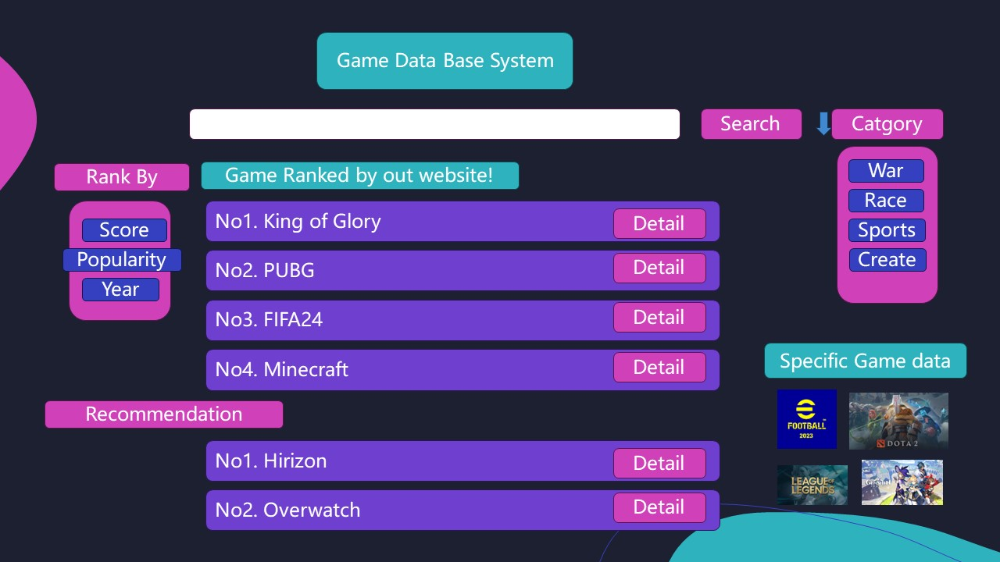
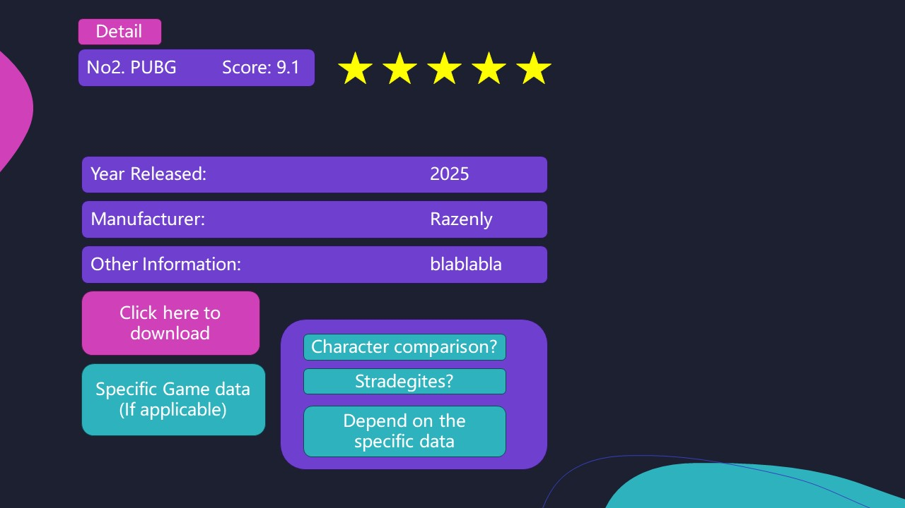

# Project Description for WHATSGAME
### Presented by team-064 Razenly
 
#### 1.Describe what data is stored in the database.

We used steam game data from a document provided by the 
instructor. The ultimate source of this data is the steam 
database, which holds information about a total of 13,352 games. 
This information includes the name of the game, a brief description,
the price, the language and the genre of the game, and other
important information that can help the user to better filter
the games they need.

#### 2.What are the basic functions of your web application?

The main functionality of this database will be divided into two 
parts. 
The first part is the filtering of games. Users can use the 
filtering interface to filter games according to their genre 
(e.g. sports, racing, role-playing, etc.), or their rating, price, 
and publication date, to get a list of games sorted from high to low compliance. This list can be used to help the user to choose the most suitable game for him/her. 

The second function is that when the user is interested in a 
certain game and clicks to enter the game's introduction interface,
it gives the user a concise and clear introduction interface,
and provides the key information and download links that the user
needs most. We noticed that when searching for a game in steam, 
the game's introduction often has too much invalid information,
which will reduce the efficiency of searching for the game. 
We will only keep the key information such as rating, release 
date and price, and provide some comparison functions, so that 
users can make a more comprehensive comparison for a few specific
games, so as to choose the most suitable game for them, saving time
and money.

If applicable, we would also like to integrate data tools to analyse
specifc games into the web application.

#### 3.What would be a good creative component (function) that can improve the functionality of your application? (What is something cool that vouwant to include? How are you planning to achieve it?)

A creative component that can significantly enhance the functionality of our application is the development of a dynamic game rating system. This system would be grounded on the comprehensive data available in our database, allowing us to assign ratings to games based on various criteria such as user reviews, popularity, and genre-specific attributes. This rating system would not only help in categorizing games more efficiently but also aid users in making informed decisions. Furthermore, we plan to incorporate features like advanced search options and detailed game information on the details page to facilitate users in finding games that suit their preferences.

#### 4.Project Title

***WhatsGame***

####  5.Proiect Summary

WhatsGame is an advanced web application that aims to promote the 
way users discover and select games on Steam. Utilizing a vast 
database, WhatsGame is committed to offering a seamless user 
experience through its dual functionality: a sophisticated game 
rating system and a detailed game introduction interface.

#### 6.Description of an application of your choice. State as clearly as possible what you want to do. What problem do you want to solve, etc.?

Our application can help the user to rank different games from 
Steam according to their preference on different aspects of the 
games. It can also give soma advice on the choice of th e game as well as give the detailed information of the games.

#### 7. Usefulness. Explain as clearly as possible why your chosen application is useful.  Make sure to answer the following questions: Are there any similar websites/applications out there?  If so, what are they, and how is yours different?

Yes, there’re many times that you may be boring and want to find some games to play. But when you face the huge number of games on the Steam,
you feel helpless and are not sure which game will fit your taste.
At this time, our application can give you a reasonable advice. There do exist such kind of application, 
like the Appstore of iPhone. However, our application focus on Steam and can do more specific selection and rank.

In addition, despite the fact that the website gives you score and 
recommendation, we will also integrate some useful game tools to 
analyse data into the website to help players with speciffc games by
our recommendation.

#### 8. Realness.  Describe what your data is and where you will get it.
Our data is the data of different games on the Steam. 
It includes many aspects of the games on Steam, such as the time it released, 
the number of DLC, the price and so on. We get it from the recommendation of TA, and we download it from Kaggle.
Other dataset of specific games might also be utilized.

#### 9. Description of the functionality that your website offers. 
The user would see a homepage of a game search interface. They can search 
for the games they are interested in using the search box. If they are not 
sure what is the name of the game, they can also use catgory button on the
right to help them locate the game.

The rank of the game would pop out, and the score and rank of these games are based on
the database and a scoring mechanism we created for the system. Users
can also rank the games by categories.

The user preference will also be recored and the data will be used to recommend
users with the games they might like base on our database.

User can also click on detail to see more information about the game.We will
also use databases for specific games to help players get more familiar with the
game.

##### A low-fidelity UI mockup:

##### Project work distribution

+ Feiyang Wu: Responsible for the progress of the whole team, monitor the git repo, and dealing with data from different dataset.
+ Yucheng Zhang: Responsible for the algorithm development and coding.
+ Junhan Luo: Responsible for the SQL coding and HTML UI design.
+ Xuecheng Liu: Redsponsible for the SQL coding and collecting and combining data.

