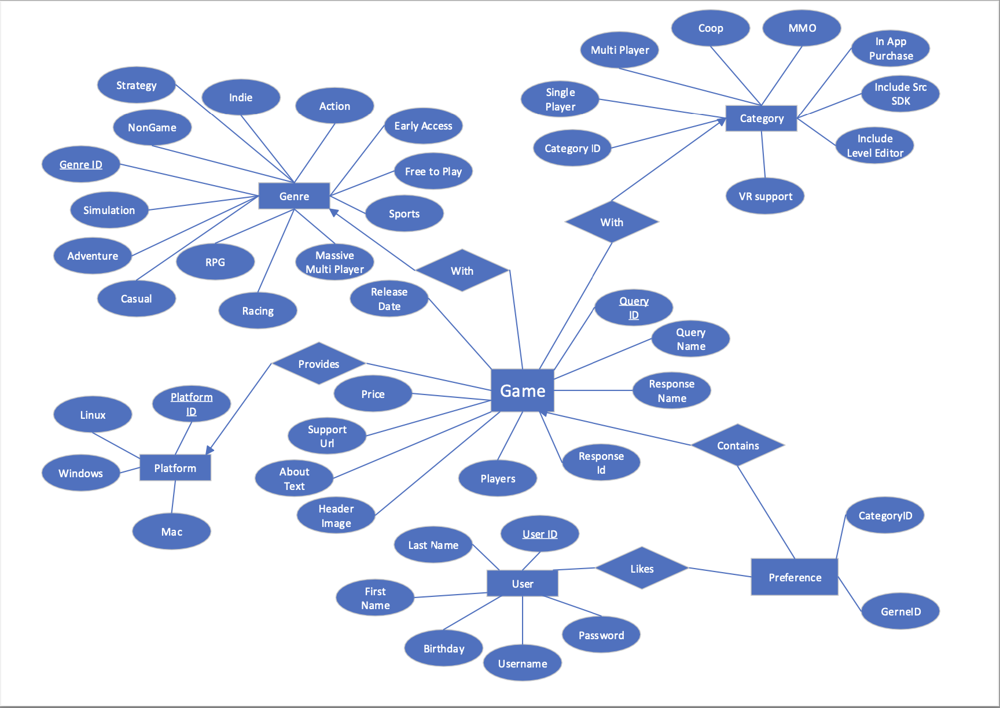
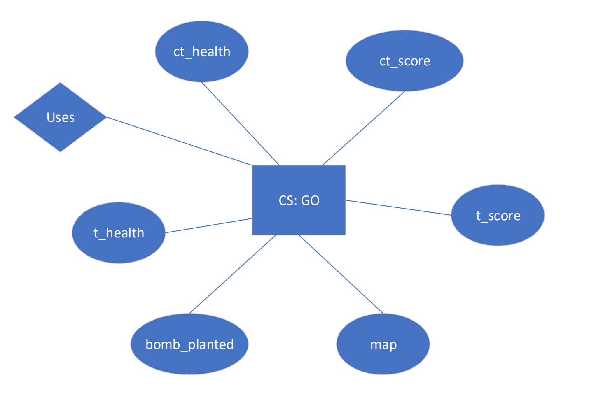
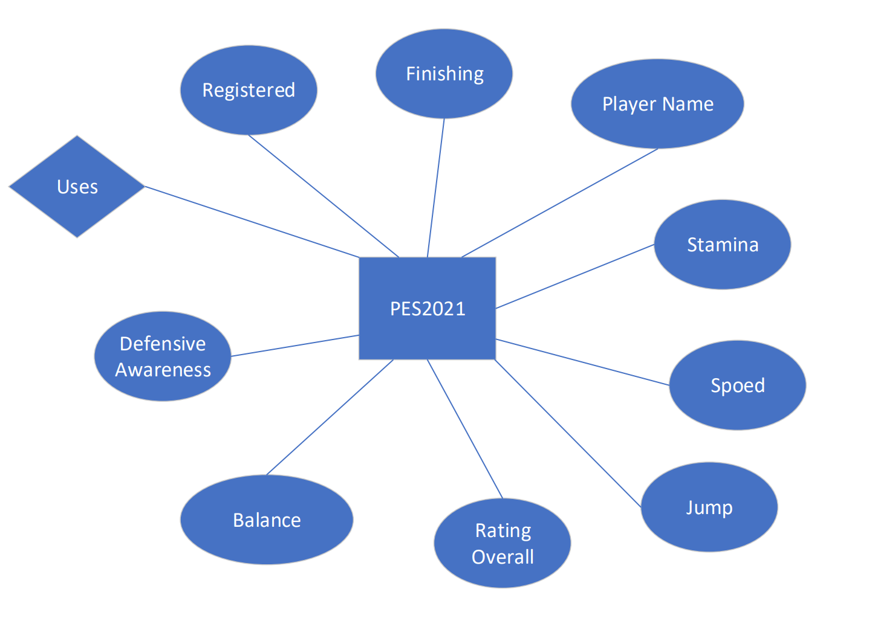
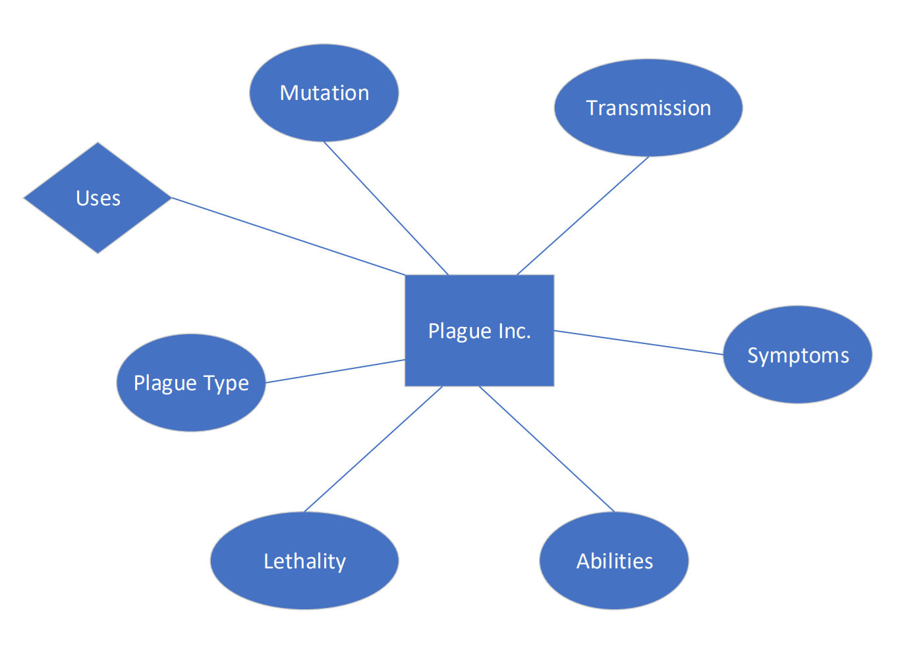

## Stage 2: Database Design
### 1. ER diagram

Our Database consists of several parts that will be displayed in several pages.

And data for the specific games( Four in total):

More games can be implemented into the database using the approach.
### 2. Assumptions and Desciption of the ER diagram
#### Assumptions about the game

1. We assume all the categories in the game will appear in the category
table.
2. We assume only four specific games are used(for demo, more can be 
applied). 
3. We think that the users can have many games he/she likes. And also 
a game can be liked by many users.
4. We believe that a certain game can be classified into different
categories of games and each category can also be shared by 
different games.
5. We think that each record in game preference can only point to one
game in the game database, but games can be repeated in gamereference
as many users can have lots of game they like.
6. For each specific game, only one record in game pair up with the 
specific game data.

#### A description of each relationship and their Cardinality
1. game_info-GamePreference: The games in GamePreference is contained in 
Game table. 
    Cardinality: one to many
2. User-GamePreference: The games that the user likes are stored in
GamePreference. 
    Cardinality: many to many
3. game_info-category: The category of the game is classified in the 
category table. 
    Cardinality: one to many

4. game_info- genre: The genre of the game is classified in the 
genre table. 
    Cardinality: one to many

5. game_info- platform: The platform of the game is classified in the 
platform table. 
    Cardinality: one to many

6. game_info-SpecificGmames: The Games table uses the specific games as 
plugin in the game searching database.
    Cardinality:one to one
    
### 3. Database Normalization

#### Choice
We choose 3NF because it’s not as strict as BCNF. When A->B, 
it can be accepted not only when A is a key, but although when B 
is a part of the key. With fewer restriction, our choice for 
relations can be more diverse to achieve different goals. 
3NF can enable us to achieve more flexible and wonderful 
functionality of our database.

#### FD
This is the final result. Actually it's also BCNF, but we still believe choosing 3NF can help us in further design.
Merge to A->BC if A->B and A->C both holds.

The result:
A (QueryID, ResponseID, GameName, ResponseName, ReleaseDate, Recommendation, Price, SupportURL, AboutText, HeaderImage, PlatformID, CategoryID, GenreID, Players, Windows, Linux, Mac, CategorySinglePlayer, CategoryMultiplayer, CategoryCoop, CategoryMMO, CategoryInAppPurchase, CategoryIncludeSrcSDK, CategoryIncludeLevelEditor, CategoryVRSupport, GenreIsNonGame, GenreIsIndie, GenreIsAction, GenreIsAdventure, GenreIsCasual, GenreIsStrategy, GenreIsRPG, GenreIsSimulation, GenreIsEarlyAccess, GenreIsFreeToPlay, GenreIsSports, GenreIsRacing, GenreIsMassivelyMultiplayer);  

B (ID, Username, Password, Windows, Linux, Mac, FirstName, LastName, Birthday, LikeNumber, UserID, GameName, GameRatingFromUser, ViewsFromUser)  

#### Normalization Process 
We can observe that QueryID is equal to ResponceID and 
GameName is equal to ResponseName, and they are all unique and 
corresponding. Thus, we can come up with the relation 
QueryId->ResponceId, GameName, and GamaName->ResponceName. 
According the ResponseName, which is the name of game, 
we can acquire the information of the game. Thus we normalize the 
game form into Query, Response and Gameinfo forms.
This is what we think at first, but according to the advice of TA,
 we put all of them into one entity.

For the part related to the informayion of the user of our database system, 
the ID havs unique corresponding password and username, 
and the rest of the information is related to the UserName, so we can
normalize the User form into Userlogin form and Userinfo form.

### 4. Translated relational schema 

1. game_info (QueryID: INT [PK], ResponseID: INT, GameName: VARCHAR(100), ResponseName: VARCHAR(100), ReleaseDate: VARCHAR(15), Recommendation: INT, Price: INT, SupportURL: VARCHAR(150), AboutText: VARCHAR(2000), HeaderImage: VARCHAR(100), PlatformID: INT [FK to platform.PlatformID], CategoryID: INT  [FK to category.CategoryID], GenreID: INT [FK to genre.GenreID], Players: INT)  
Form of the information of the game, Cardinality=13300.  
Each ResponceName is a unique name of a game, which will derive the rest information of the game.  

2. platform (PlatformID: INT [PK], Windows: Boolean, Linux: Boolean, Mac: Boolean).  
Stores the information of the platform support for each game. Cardinality=8. 

3. category (CategoryID: INT [PK], CategorySinglePlayer: Boolean, CategoryMultiplayer: Boolean, CategoryCoop: Boolean, CategoryMMO: Boolean, CategoryInAppPurchase: Boolean, CategoryIncludeSrcSDK: Boolean, CategoryIncludeLevelEditor: Boolean, CategoryVRSupport: Boolean);  
Stores the whether the game can be devided into corresponding category. Cardinality=256.  

4. genre (GenreID: INT [PK], GenreIsNonGame: Boolean, GenreIsIndie: Boolean, GenreIsAction: Boolean, GenreIsAdventure: Boolean, GenreIsCasual: Boolean, GenreIsStrategy: Boolean, GenreIsRPG: Boolean, GenreIsSimulation: Boolean, GenreIsEarlyAccess: Boolean, GenreIsFreeToPlay: Boolean, GenreIsSports: Boolean, GenreIsRacing: Boolean, GenreIsMassivelyMultiplayer: Boolean);  
This form stores the type of the games. Cardinality=8192   

5. Userlogin (ID: INT [PK], Username: VARCHAR(20), Password: VARCHAR(20))  
Form for the login process of user, Cardinality=1000. 
The form is for the login process, an ID has corresponding right password and its user name.  

6. Userinfo (Username: VARCHAR(20) [PK], Windows: INT, Linux: INT, Mac: INT, FirstName: VARCHAR(20), LastName: VARCHAR(20), Birthday: VARCHAR(10))  
Form for the information of the user, Cardinality=1000  
Under each account with a unique UserName, we have the information of the owner of the account.  

7. GameLikes (LikeNumber:INT [PK], UserID: INT [FK to User.ID], GameName: VARCHAR(100) ([FK to Game.GameName]), GameRatingFromUser: INT, ViewsFromUser: INT)  
Form of the likes of games, Cardinality=5000  
Store the likes condition of the users.  

### 5. Modification from the previous suggesion
First, as for the creativity part of the game search database,
we would like to incorporate specific game data manifestation 
plugins, for example, when user search for a FPS game, except 
for finding out the rating and reviews for the game, he/she can also 
find the visualization of the weapon data from this specific game
using radar chart so that can be compared very easily. 
This plugin is very creative because users who like the game don’t 
usually have a clear conception of data in the game, but our 
visualization can help our users. Because we don’t have time and 
energy to find all the specific game data for each game appearing 
on the steam game data TA provided, we would like to make demo of 
four games that we find ourselves.

Second, as for the source of the data, except for the database 
TA provides, now we have data of PES2021 from 
https://www.kaggle.com/datasets/homerkommrad/efootball-pes2021-all-players-csv, 
CSGO data from https://www.kaggle.com/datasets/vatsalparsaniya/csgo-weapons, plague INC 
data from https://plagueinc.fandom.com/wiki/ and  the Elder Scrolls V from 
https://elderscrolls.fandom.com/wiki/The_Elder_Scrolls_V:_Skyrim.
