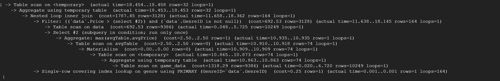
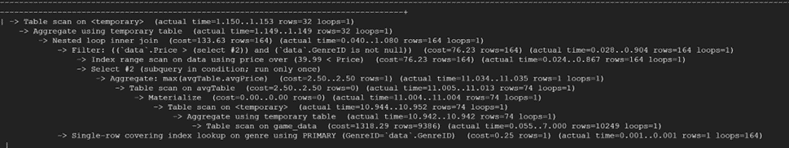
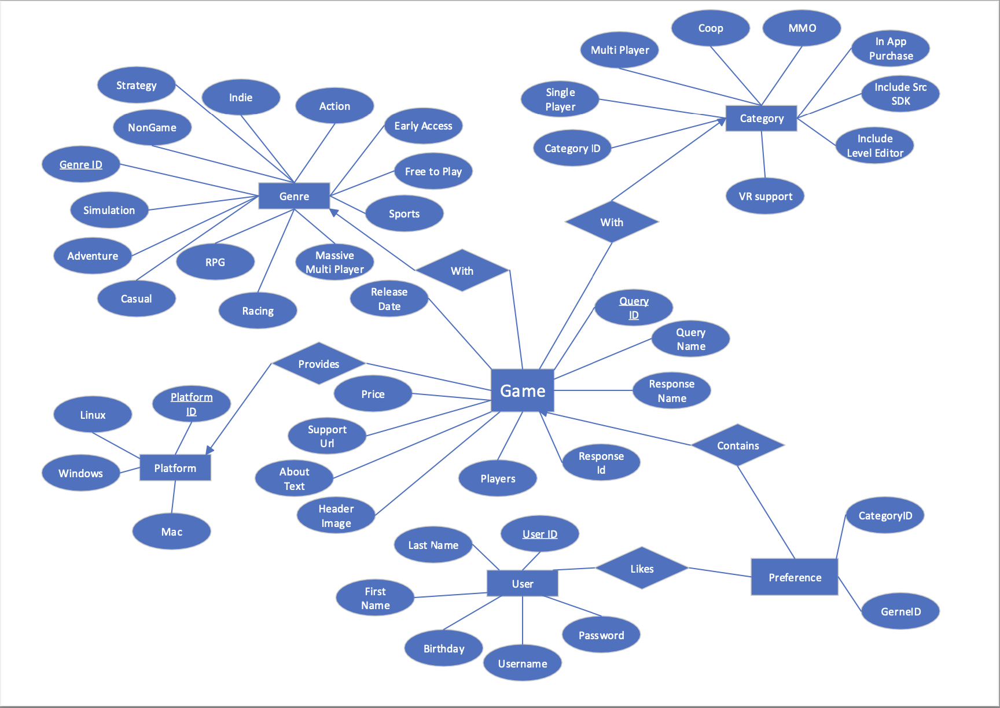

## Stage 3: Database Implementation and Indexing
### Part1:
1. Implementing the database tables on GCP, screenshot of the connection

2. DDL commands of our tables:

```sql
(the following are the DDL of create game_data table, which is lost in stage3)
CREATE TABLE game_data (
    QueryID INT,
    ResponseID INT,
    GameName VARCHAR(255),
    ResponseName VARCHAR(255),
    ReleaseDate DATE,
    Recommendation INT,
    Price DECIMAL(10, 2),
    SupportURL VARCHAR(255),
    AboutText TEXT,
    HeaderImage VARCHAR(255),
    PlatformID INT,
    CategoryID INT,
    GenreID INT,
    Players INT,
    PRIMARY KEY (QueryID)
);
```
```sql
CREATE TABLE GameCategories ( 
    CategoryID INT PRIMARY KEY, 
    CategorySinglePlayer BOOLEAN NOT NULL, 
    CategoryMultiplayer BOOLEAN NOT NULL, 
    CategoryCoop BOOLEAN NOT NULL, 
    CategoryMMO BOOLEAN NOT NULL, 
    CategoryInAppPurchase BOOLEAN NOT NULL, 
    CategoryIncludeSrcSDK BOOLEAN NOT NULL, 
    CategoryIncludeLevelEditor BOOLEAN NOT NULL, 
    CategoryVRSupport BOOLEAN NOT NULL );
```
```sql
CREATE TABLE GameGenres (
    GenreID INT PRIMARY KEY,
    GenreIsNonGame BOOLEAN NOT NULL,
    GenreIsIndie BOOLEAN NOT NULL,
    GenreIsAction BOOLEAN NOT NULL,
    GenreIsAdventure BOOLEAN NOT NULL,
    GenreIsCasual BOOLEAN NOT NULL,
    GenreIsStrategy BOOLEAN NOT NULL,
    GenreIsRPG BOOLEAN NOT NULL,
    GenreIsSimulation BOOLEAN NOT NULL,
    GenreIsEarlyAccess BOOLEAN NOT NULL,
    GenreIsFreeToPlay BOOLEAN NOT NULL,
    GenreIsSports BOOLEAN NOT NULL,
    GenreIsRacing BOOLEAN NOT NULL,
    GenreIsMassivelyMultiplayer BOOLEAN NOT NULL
);
```
```sql
CREATE TABLE GamePlatforms (
    PlatformID INT PRIMARY KEY,
    Windows BOOLEAN NOT NULL,
    Linux BOOLEAN NOT NULL,
    Mac BOOLEAN NOT NULL
);
```
```sql
CREATE TABLE Users (
    UserID INT PRIMARY KEY,
    UserAccount VARCHAR(255) NOT NULL UNIQUE,
    UserPassword VARCHAR(255) NOT NULL,
    UserName VARCHAR(255) NOT NULL,
    UserPhonenumber VARCHAR(15) NOT NULL,
    UserEmail VARCHAR(255) NOT NULL,
    UserJoinYear INT NOT NULL
);
```
```sql
CREATE TABLE UserGamePreference ( 
    UserID INT NOT NULL, 
    QueryID INT NOT NULL, 
    CategoryID INT, 
    GenreID INT, 
    PRIMARY KEY (UserID, QueryID) 
)
```
3. Inserting at least 1000 rows in 3 tables. Using count queries.
```sql
SELECT COUNT(*) as TotalOrders
FROM game_data;
```

```sql
SELECT COUNT(*) as TotalUser
FROM Users;
```

```sql
SELECT COUNT(*) as TotalPreference
FROM UserGamePreference;
```

```sql
SELECT COUNT(*) as TotalGenre
FROM Genre;
```


4. Advanced Queries and query results

Query1
```sql
SELECT data.GenreID, COUNT(data.QueryID) as GameCount
FROM game_data data
NATURAL JOIN Genres genre
WHERE data.Price > (SELECT MAX(avgPrice) FROM (SELECT CategoryID, AVG(Price) as avgPrice FROM game_data GROUP BY CategoryID) as avgTable)
GROUP BY data.GenreID;
```

Query 2
```sql
(SELECT Category.ID, AVG(Price) as avgprice
FROM (game_data Natural Join Genres) join Category ON game_data.CategoryID = Category.ID
WHERE GameName LIKE 'B%' AND GenreID>10
GROUP BY Category.ID
ORDER BY avgprice DESC 
LIMIT 10)
UNION
(SELECT Category.ID, AVG(Price) as avgprice
FROM (game_data Natural Join Genres) join Category ON game_data.CategoryID = Category.ID
WHERE ID>1 AND CategorySinglePlayer=1
GROUP BY Category.ID
ORDER BY avgprice ASC )
ORDER BY avgprice DESC;
```

Query3
```sql
(SELECT 
    COUNT(U.UserID) as CountUserID,
    U.UserJoinYear,
    YEAR(g.ReleaseDate) AS ReleaseYear,
    CEIL(AVG(g.Players)) as AveragePlayers
FROM Users U
INNER JOIN 
    UserGamePreference ON U.UserID = UserGamePreference.UserID
INNER JOIN 
    game_data g_favorite ON UserGamePreference.QueryID = g_favorite.QueryID
INNER JOIN 
    game_data g ON g_favorite.QueryID = g.QueryID
WHERE 
    YEAR(g.ReleaseDate) > 2010 
    AND g.PlatformID = 7
GROUP BY 
    U.UserJoinYear, YEAR(g.ReleaseDate)
HAVING 
    AVG(g.Players) > 100000 
ORDER BY 
    ReleaseYear DESC, AveragePlayers DESC)

UNION

(SELECT 
    COUNT(Users.UserID) as CountUserID,
    Users.UserJoinYear,
    YEAR(g.ReleaseDate) AS ReleaseYear,
    CEIL(AVG(g.Players)) as AveragePlayers 
FROM Users 
INNER JOIN 
    UserGamePreference ON Users.UserID = UserGamePreference.UserID
INNER JOIN 
    game_data g_favorite ON UserGamePreference.QueryID = g_favorite.QueryID
INNER JOIN 
    game_data g ON g_favorite.QueryID = g.QueryID
WHERE Users.UserJoinYear = YEAR(g.ReleaseDate)
GROUP BY 
    Users.UserJoinYear, YEAR(g.ReleaseDate)
HAVING 
    AVG(g.Players) > 100000 
ORDER BY 
    ReleaseYear DESC, AveragePlayers DESC
);
```


Query 4
```sql
(SELECT 
    NULL AS ReleaseYear,
    g.GenreID, 
    c.ID AS CategoryID, 
    COUNT(DISTINCT g.QueryID) AS GameCount, 
    AVG(g.Price) AS AvgPrice, 
    (SELECT AVG(Price) FROM game_data gd WHERE gd.CategoryID = c.ID) AS AvgPricePerCategory
FROM game_data g
JOIN Category c ON g.CategoryID = c.ID
WHERE g.Price > (SELECT AVG(Price) FROM game_data gd WHERE gd.CategoryID = g.CategoryID)
AND g.GenreID > 10
GROUP BY g.GenreID, c.ID)
UNION ALL
(SELECT 
    YEAR(g.ReleaseDate) AS ReleaseYear, 
    g.GenreID, 
    NULL AS CategoryID, 
    COUNT(DISTINCT g.QueryID) AS GameCount, 
    AVG(g.Price) AS AvgPrice, 
    NULL AS AvgPricePerCategory
FROM game_data g
WHERE Players > (SELECT AVG(Players) * 1.5 FROM game_data WHERE PlatformID = 7)
AND g.PlatformID = 7
GROUP BY YEAR(g.ReleaseDate), g.GenreID)
ORDER BY GameCount DESC;
```

### Part 2 Indexing
1. Query 1 analysis

We find that UserJoinYear can be an index.

Result:


No difference, because price is not a thing need to scan for.


Another way we find is that added categoryID index, because the use of subquery group by CategoryID.

Result:

After the table scan is converted to scan on index category, but no significant improvement in efficiency is observed, we believe that the speed is too fast and the actual effect of the optimization is affected by the speed fluctuation.


The final thought was because the initial line used count (queryID), so we added index

Result:

But because the initial line was actually used for a very short time, it was optimized but had very little impact on the overall picture, or it could have been that it was going to traverse most of it resulting in a negative optimization of the b+tree instead.

2. Query 2 analysis

Add an index on GenreID and CategoryID, because there’s a table scan on game data.

Result:


Little improvement, because the table scan on game_data is changed to using index to search on category according to the output.

Another try to add an index on CategorySinglePlayer because it’s not a primary key and is used in the query.

Result:


More evident improvement, because compared with the previous optimization, while CategoryID doesn’t have an index in game_data, it’s the primary key of Category. But CategorySinglePlayer doesn’t have any index before that.

The following is the third analyze.We found that the average of price was used, so we tried adding index.

Result:


There is optimization but not much because it was originally avg(price).

3. Query 3 analysis

We find that UserJoinYear can be an index.

Result:


No difference, because price is not a thing need to scan for.

4. Query 4 analysis

We try to add someindexes to improve the speed.

Result:


We try many kind of index, but all of them don’t work here. Actually, the time cost becomes longer, maybe we add too many indexes.
### Part 3: Revision From Stage 2
From the stage 2, we changed many aspects of the arrangement of our design.
The first and most important difference is showed by the ER diagram.


First of all, the new version of the diagram combines the original Windows, Linux, and Mac attributes that represent compatible platforms with values of 0/1 into one attribute, PlatformID, which is a binary number and each bit of it represents a 0/1 of the initial table, and uses a one-to-many dependency table to describe the corresponding PlatformIDs, which simplifies the main table and improves the speed of searching for regular data.
Second, we take a similar approach to Category. Originally, this attribute would have been a string, and strings can cause a lot of trouble when looking up specific types, especially games that belong to a few specific types. Now, we can easily find games by using schedules. In addition, we have added a new GenreID attribute and a Genre table to help users find the games they need more easily and accurately.
In addition, we removed specific game names and added some attributes that are generic and removed specific attributes, making the model more generic and providing a more standardized model for the data.
We also did some fine-tuning of the content of the attributes of the users and references tables so that the tables better fit our needs.

The second difference is about the Cardinality.
We added more cardinality as you can see in the ER diagram.
There are more interaction paths between the "Game" node and other nodes, which allows for a more nuanced description of the relationship between the game and other entities. They are  game_info--genre and game_info--platform. Also, the interaction between game_info--category has been modified.


The third is about the FD.
We have modified our original FD to correspond to our now modified table, attributes and relations. It is still in 3NF form.


The fourth is the relation schema and its DDL SQL.
First, we now have a more detailed categorization system. We have introduced "platform", "category" and "genre", which allows game information to be organized and queried in a more systematic way.
We now use integer IDs more often as primary keys, which is faster to query, saves storage space, and is easier to manage than using VARCHAR fields as primary keys.
Additionally, we now use Boolean data types (aka 0 and 1 values) to categorize the platform, category and type of the game in the sub-tables, while the main table is indexed using the corresponding ID as a foreign key. This design makes storing and querying game information more flexible and efficient, with stronger pointers. the IDs are essentially binary numbers, which are easy and quick to correspond to the variance through the fetch as operation.
